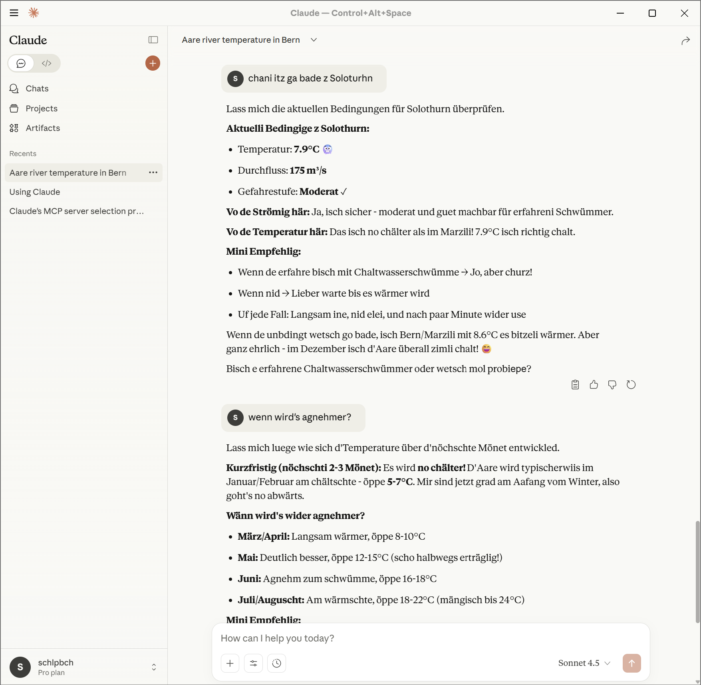

# Aareguru MCP Server

[](https://aareguru.fastmcp.app/mcp)
[](tests/)
[](tests/)
[](pyproject.toml)
[](https://github.com/jlowin/fastmcp)

MCP server for Swiss Aare river data, enabling AI assistants like Claude to answer questions about swimming conditions, water temperature, flow rates, and safety.

## 🚀 Quick Start

**Use directly from FastMCP Cloud** (no installation needed):

Add to Claude Desktop config (see [`claude_desktop_remote_config.json`](claude_desktop_remote_config.json)):

```json
{
  "mcpServers": {
    "aareguru": {
      "url": "https://aareguru.fastmcp.app/mcp"
    }
  }
}
```

## 📸 Screenshots

<p align="center">
  
  
</p>

## 🎯 Features

| Feature | Description |
|---------|-------------|
| **7 MCP Tools** | Temperature, flow, safety, forecasts, comparisons, history |
| **4 MCP Resources** | Direct data access via `aareguru://` URIs |
| **Swiss German** | Authentic temperature descriptions ("geil aber chli chalt") |
| **BAFU Safety** | Official flow danger levels and thresholds |
| **Smart UX** | Proactive safety warnings, alternative suggestions, seasonal context |
| **200 Tests** | 87% coverage, comprehensive test suite |

## 🛠️ Tools

| Tool | Description | Example Query |
|------|-------------|---------------|
| `get_current_temperature` | Water temperature with Swiss German text | "What's the Aare temperature?" |
| `get_current_conditions` | Full conditions (temp, flow, weather) | "How's the Aare looking today?" |
| `get_flow_danger_level` | Flow rate + BAFU safety assessment | "Is it safe to swim?" |
| `list_cities` | All monitored cities | "Which cities have data?" |
| `get_historical_data` | Temperature/flow history | "Show last 7 days" |
| `compare_cities` | Multi-city comparison | "Which city is warmest?" |
| `get_forecast` | Temperature/flow forecast | "Will it be warmer later?" |

### BAFU Safety Thresholds

| Flow Rate | Level | Status |
|-----------|-------|--------|
| < 100 m³/s | Safe | Swimming OK |
| 100-220 m³/s | Moderate | Experienced swimmers only |
| 220-300 m³/s | Elevated | Caution advised |
| 300-430 m³/s | High | Dangerous |
| > 430 m³/s | Very High | Extremely dangerous |

## 📊 Resources

| URI | Description |
|-----|-------------|
| `aareguru://cities` | List of all monitored cities |
| `aareguru://current/{city}` | Full current data for a city |
| `aareguru://today/{city}` | Minimal current data |
| `aareguru://widget` | Overview of all cities |

## 💻 Local Installation

```bash
# Install uv and clone
curl -LsSf https://astral.sh/uv/install.sh | sh
git clone https://github.com/schlpbch/aareguru-mcp.git && cd aareguru-mcp
uv sync

# Run tests
uv run pytest
```

### Claude Desktop (Local)

Edit `~/Library/Application Support/Claude/claude_desktop_config.json`:

```json
{
  "mcpServers": {
    "aareguru": {
      "command": "uv",
      "args": ["--directory", "/path/to/aareguru-mcp", "run", "aareguru-mcp"]
    }
  }
}
```

## 🐳 Docker

```bash
cp .env.example .env
docker-compose up -d
curl http://localhost:8000/health
```

## 🧪 Development

```bash
uv run pytest                    # Run tests
uv run pytest --cov=aareguru_mcp # With coverage
uv run black src/ tests/         # Format
uv run ruff check src/ tests/    # Lint
```

## 📁 Project Structure

```
aareguru-mcp/
├── src/aareguru_mcp/     # Server, client, models, config
├── tests/                # 200 tests, 87% coverage
├── docs/                 # API docs, testing, implementation
├── mcp_server.py         # FastMCP CLI entry
└── pyproject.toml
```

## 🔒 Data Attribution

Data from [BAFU](https://www.hydrodaten.admin.ch), [Aare.guru](https://aare.guru), MeteoSchweiz, Meteotest.

> **Non-commercial use only** - Contact: aaregurus@existenz.ch

## 📄 License

MIT License - See [LICENSE](LICENSE)

---

**Built with ❤️ for the Swiss Aare swimming community**
