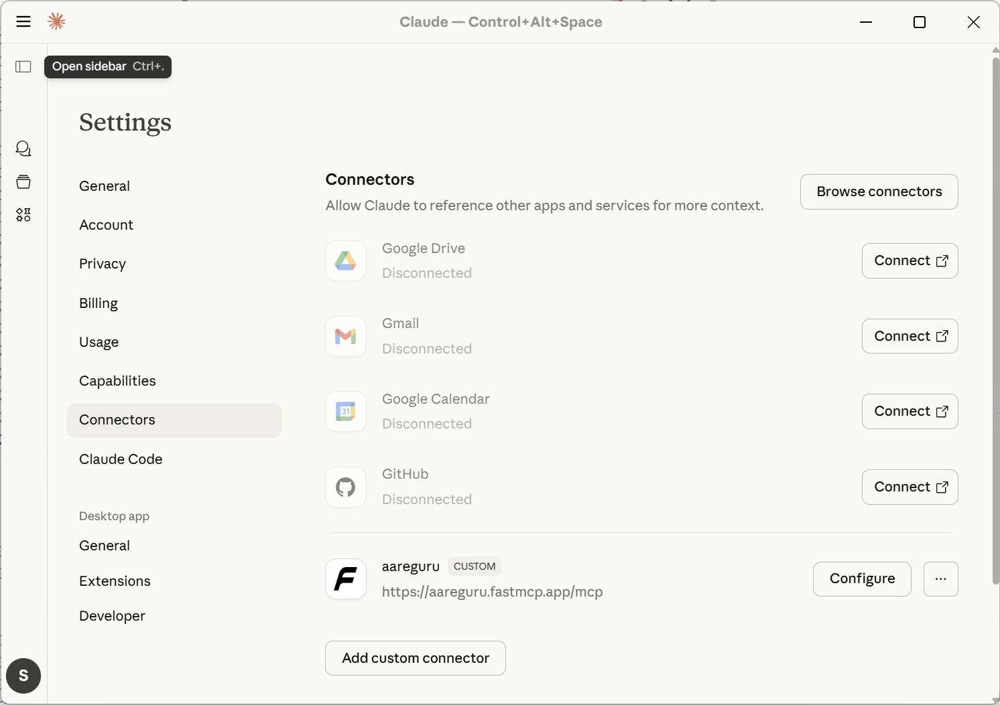

# Aareguru MCP Server

[](https://aareguru.fastmcp.app/health/)
[](tests/)
[](tests/)
[](pyproject.toml)
[](https://github.com/jlowin/fastmcp)

MCP server for Swiss Aare river data, enabling AI assistants like Claude to
answer questions about swimming conditions, water temperature, flow rates, and
safety.

## 🚀 Quick Start

**Use directly from FastMCP Cloud** (no installation needed):


Add it is as *custom connector* in Claude Desktop:



No authentication is needed.

Altnernatively, you can add the [aareguru-mcp.mcpb](aareguru-mcp.mcpb) file via option in `Claude -> Settings -> Extensions`. Or edit the Claude desktop config file directly:

```json
{
  "mcpServers": {
    "aareguru": {
      "url": "https://aareguru.fastmcp.app/mcp"
    }
  }
}
```


## 📸 Screenshots


## 🎯 Features

| Feature              | Description                                                          |
| -------------------- | -------------------------------------------------------------------- |
| **7 MCP Tools**      | Temperature, flow, safety, forecasts, comparisons, history           |
| **4 MCP Resources**  | Direct data access via `aareguru://` URIs                            |
| **3 MCP Prompts**    | Daily reports, spot comparisons, weekly trends                       |
| **Rate Limiting**    | 100 req/min, 1000 req/hour protection against abuse                  |
| **Metrics**          | Prometheus endpoint for monitoring and observability                 |
| **Swiss German**     | Authentic temperature descriptions ("geil aber chli chalt")          |
| **BAFU Safety**      | Official flow danger levels and thresholds                           |
| **Smart UX**         | Proactive safety warnings, alternative suggestions, seasonal context |
| **200+ Tests**       | 83% coverage, comprehensive test suite                               |

## 🛠️ Tools

| Tool                      | Description                              | Example Query                   |
| ------------------------- | ---------------------------------------- | ------------------------------- |
| `get_current_temperature` | Water temperature with Swiss German text | "What's the Aare temperature?"  |
| `get_current_conditions`  | Full conditions (temp, flow, weather)    | "How's the Aare looking today?" |
| `get_flow_danger_level`   | Flow rate + BAFU safety assessment       | "Is it safe to swim?"           |
| `list_cities`             | All monitored cities                     | "Which cities have data?"       |
| `get_historical_data`     | Temperature/flow history                 | "Show last 7 days"              |
| `compare_cities`          | Multi-city comparison                    | "Which city is warmest?"        |
| `get_forecast`            | Temperature/flow forecast                | "Will it be warmer later?"      |

### BAFU Safety Thresholds

| Flow Rate    | Level     | Status                    |
| ------------ | --------- | ------------------------- |
| < 100 m³/s   | Safe      | Swimming OK               |
| 100-220 m³/s | Moderate  | Experienced swimmers only |
| 220-300 m³/s | Elevated  | Caution advised           |
| 300-430 m³/s | High      | Dangerous                 |
| > 430 m³/s   | Very High | Extremely dangerous       |

## 📊 Resources

| URI                         | Description                  |
| --------------------------- | ---------------------------- |
| `aareguru://cities`         | List of all monitored cities |
| `aareguru://current/{city}` | Full current data for a city |
| `aareguru://today/{city}`   | Minimal current data         |
| `aareguru://widget`         | Overview of all cities       |

## 💬 Prompts

| Prompt                   | Description                                                                      |
| ------------------------ | -------------------------------------------------------------------------------- |
| `daily_swimming_report`  | Comprehensive daily report with conditions, safety, forecast, and recommendation |
| `compare_swimming_spots` | Compare all cities to find the best swimming spot today                          |
| `weekly_trend_analysis`  | Analyze temperature and flow trends over the past week                           |

## 💻 Local Installation

```bash
# Install uv and clone
curl -LsSf https://astral.sh/uv/install.sh | sh
git clone https://github.com/schlpbch/aareguru-mcp.git && cd aareguru-mcp
uv sync

# Run tests
uv run pytest
```

### Claude Desktop (Local)

Edit `~/Library/Application Support/Claude/claude_desktop_config.json`:

```json
{
  "mcpServers": {
    "aareguru": {
      "command": "uv",
      "args": ["--directory", "/path/to/aareguru-mcp", "run", "aareguru-mcp"]
    }
  }
}
```

## 🐳 Docker

```bash
cp .env.example .env
docker-compose up -d
curl http://localhost:8000/health
```

## ☁️ Hosting

### FastMCP Cloud (Recommended)

This server is deployed on [FastMCP Cloud](https://fastmcp.cloud), a managed platform for MCP servers with zero-config deployment.

**Features:**

- ✅ **Zero-Config Deployment** - Connect GitHub repo, automatic deployment
- ✅ **Serverless Scaling** - Scale from 0 to millions of requests instantly
- ✅ **Git-Native CI/CD** - Auto-deploy on push to `main`, branch deployments for PRs
- ✅ **Built-in Security** - OAuth support, token management, secure endpoints
- ✅ **MCP Analytics** - Request/response tracking, tool usage insights
- ✅ **Free Tier** - Available for personal servers

**Deployment Steps:**

1. **Sign in** to [fastmcp.cloud](https://fastmcp.cloud) with GitHub
2. **Create Project** and link your repository
3. **Deploy** - Platform automatically clones, builds, and deploys
4. **Access** - Get your unique URL (e.g., `https://aareguru.fastmcp.app/mcp`)

**Configuration:**

No special configuration needed! FastMCP Cloud auto-detects FastMCP servers. The server runs with:
- Health endpoint: `https://your-app.fastmcp.app/health`
- MCP endpoint: `https://your-app.fastmcp.app/mcp`

**Pricing:**

- Free tier for personal projects
- Pay-as-you-go for teams (usage-based)

### Alternative Hosting Options

FastMCP servers can be deployed to any Python-compatible cloud platform:

**Container Platforms:**

- Google Cloud Run
- AWS ECS/Fargate
- Azure Container Instances

**PaaS Providers:**

- Railway
- Render
- Vercel

**Cloud VMs:**

- AWS EC2
- Google Compute Engine
- Azure VMs

**Deployment Pattern:**

```python
# For HTTP deployment, modify server to use HTTP transport
from fastmcp import FastMCP

mcp = FastMCP("aareguru")
# ... register tools ...

if __name__ == "__main__":
    mcp.run(transport="sse")  # Server-Sent Events for HTTP
```

Then containerize with Docker and deploy to your chosen platform.

## 📊 Monitoring & Observability

### Prometheus Metrics

The server exposes Prometheus-compatible metrics at `/metrics` for monitoring:

**Available Metrics:**
- `aareguru_mcp_tool_calls_total` - Counter of tool invocations by name and status
- `aareguru_mcp_tool_duration_seconds` - Histogram of tool execution times
- `aareguru_mcp_api_requests_total` - Counter of Aareguru API requests
- `aareguru_mcp_errors_total` - Counter of errors by type and component
- `aareguru_mcp_active_requests` - Gauge of currently active requests

**Example:**
```bash
curl http://localhost:8000/metrics
```

### Rate Limiting

HTTP endpoints are protected with rate limiting:
- **Default limits**: 100 requests/minute, 1000 requests/hour
- **Health endpoint**: 60 requests/minute
- **Headers**: Rate limit info included in responses
- **429 responses**: Automatic retry-after headers when limits exceeded

## 🧪 Development

```bash
uv run pytest                    # Run tests
uv run pytest --cov=aareguru_mcp # With coverage
uv run black src/ tests/         # Format
uv run ruff check src/ tests/    # Lint
```

## 📁 Project Structure

```
aareguru-mcp/
├── src/aareguru_mcp/     # Server, client, models, config
├── tests/                # 200 tests, 87% coverage
├── docs/                 # API docs, testing, implementation
├── mcp_server.py         # FastMCP CLI entry
└── pyproject.toml
```

## 🔒 Data Attribution

Data from [BAFU](https://www.hydrodaten.admin.ch),
[Aare.guru](https://aare.guru), MeteoSchweiz, Meteotest.

> **Non-commercial use only** - Contact: aaregurus@existenz.ch

## 📄 License

MIT License - See [LICENSE](LICENSE)

---

**Built with ❤️ for the Swiss Aare swimming community**
