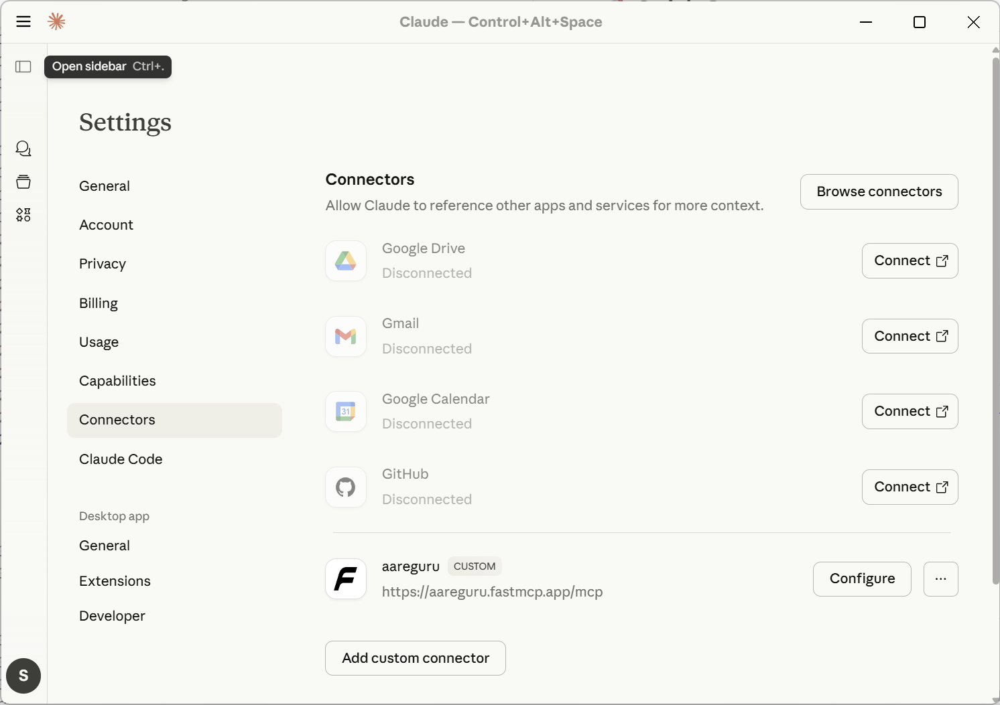
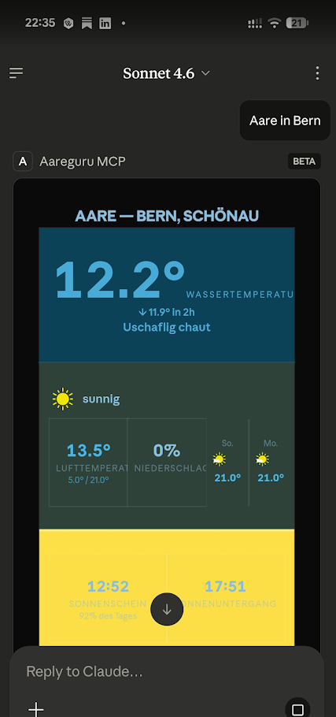
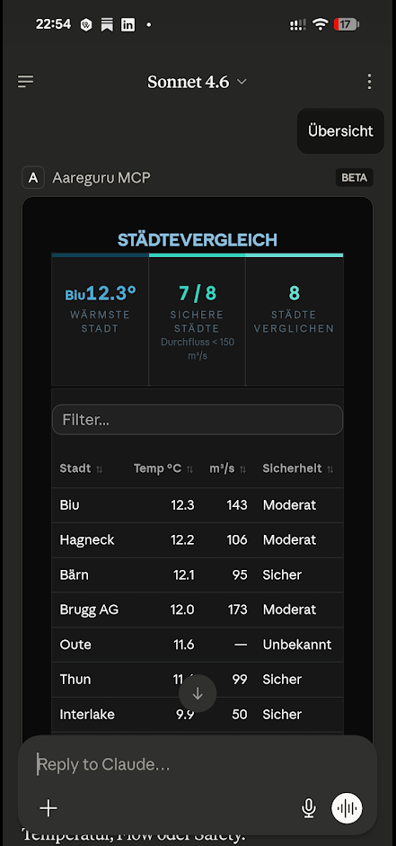
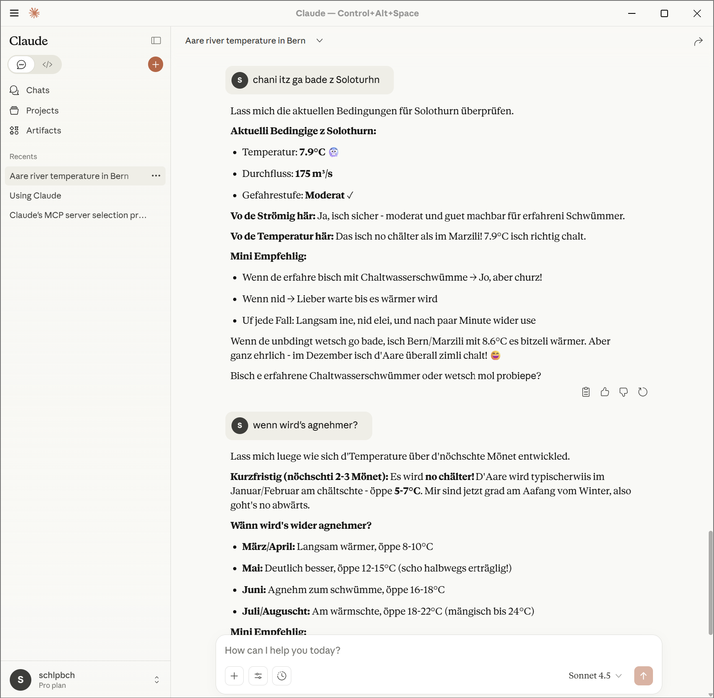
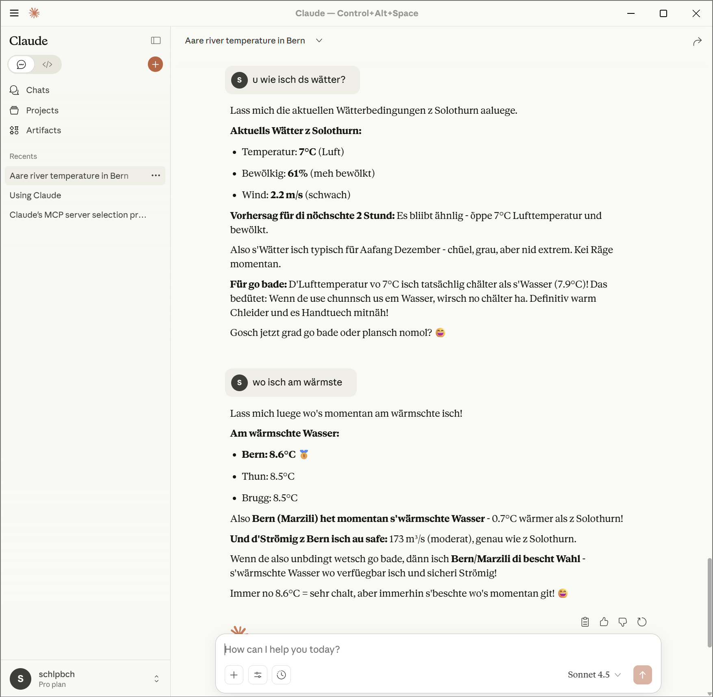
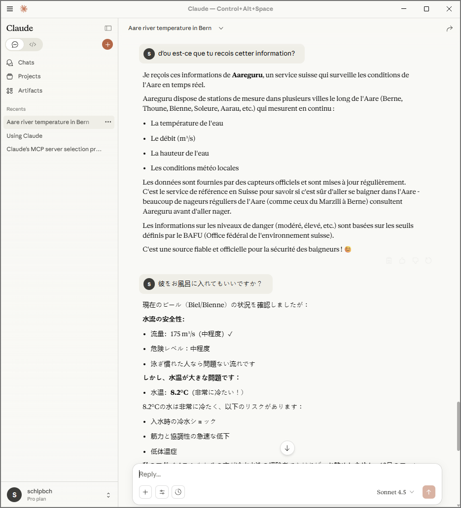

# Aareguru MCP Server

[](https://aareguru.fastmcp.app/health/)
[](tests/)
[](tests/)
[](pyproject.toml)
[](https://github.com/jlowin/fastmcp)
[](CHANGELOG.md)
[](PRIVACY.md)

MCP server for Swiss Aare river data, enabling AI assistants like Claude to
answer questions about swimming conditions, water temperature, flow rates, and
safety.

**Latest Release: v4.6.0** — governance documentation (CONSTITUTION.md,
SKILLS.md), 8 FastMCPApps (incl. OpenStreetMap), 7 MCP resources, MCP
elicitation, 365 tests (80% coverage). See
[docs/RELEASE_NOTES_v4.6.0.md](docs/RELEASE_NOTES_v4.6.0.md) for details.

## 🚀 Quick Start

**Use directly from FastMCP Cloud** (no installation needed).

Add it as a _custom connector_ in Claude Desktop:



No authentication is needed.

Alternatively, add the [aareguru-mcp.mcpb](aareguru-mcp.mcpb) file via
`Claude → Settings → Extensions`, or edit the Claude Desktop config directly:

```json
{
  "mcpServers": {
    "aareguru": {
      "url": "https://aareguru.fastmcp.app/mcp"
    }
  }
}
```

## 📸 Screenshots

 




## 🎯 Features

| Feature             | Description                                                      |
| ------------------- | ---------------------------------------------------------------- |
| **6 MCP Tools**     | Temperature, flow, safety, forecasts, history, comparisons       |
| **7 MCP Resources** | Direct data access via `aareguru://` URIs                        |
| **3 MCP Prompts**   | Daily reports, spot comparisons, weekly trends                   |
| **8 FastMCPApps**   | Interactive dashboards, charts, map — rendered in conversation   |
| **MCP Elicitation** | Asks for confirmation on dangerous flows and large data requests |
| **Rate Limiting**   | 100 req/min, 1000 req/hour protection against abuse              |
| **Metrics**         | Prometheus endpoint for monitoring and observability             |
| **Swiss German**    | Authentic temperature descriptions ("geil aber chli chalt")      |
| **BAFU Safety**     | Official flow danger levels and thresholds                       |
| **365 Tests**       | 80% coverage, comprehensive test suite (0 skipped)               |
| **Async-First**     | Context managers, parallel API fetching with asyncio.gather()    |

## 🛠️ Tools

| Tool                      | Description                              | Example Query                   |
| ------------------------- | ---------------------------------------- | ------------------------------- |
| `get_current_temperature` | Water temperature with Swiss German text | "What's the Aare temperature?"  |
| `get_current_conditions`  | Full conditions (temp, flow, weather)    | "How's the Aare looking today?" |
| `get_flow_danger_level`   | Flow rate + BAFU safety assessment       | "Is it safe to swim?"           |
| `compare_cities`          | Compare all cities (parallel fetching)   | "Which city is warmest?"        |
| `get_forecasts`           | Forecasts for multiple cities (parallel) | "Show forecasts for all cities" |
| `get_historical_data`     | Temperature/flow history (hourly data)   | "Show last 7 days for Bern"     |

### BAFU Safety Thresholds

| Flow Rate    | Level     | Status                    |
| ------------ | --------- | ------------------------- |
| < 100 m³/s   | Safe      | Swimming OK               |
| 100–220 m³/s | Moderate  | Experienced swimmers only |
| 220–300 m³/s | Elevated  | Caution advised           |
| 300–430 m³/s | High      | Dangerous                 |
| > 430 m³/s   | Very High | Extremely dangerous       |

## 📊 Resources

| URI                                       | Description                           |
| ----------------------------------------- | ------------------------------------- |
| `aareguru://cities`                       | All monitored cities with coordinates |
| `aareguru://current/{city}`               | Full current conditions for a city    |
| `aareguru://today/{city}`                 | Minimal current snapshot              |
| `aareguru://forecast/{city}`              | Weather forecast entries              |
| `aareguru://history/{city}/{start}/{end}` | Historical hourly time series         |
| `aareguru://safety-levels`                | BAFU 1–5 danger level reference table |
| `aareguru://thresholds`                   | Flow zone breakpoints with hex colors |

## 🖥️ Interactive Apps (FastMCPApps)

Eight apps render rich UIs directly inside AI conversations via `fastmcp[apps]`:

| App           | Description                                                   |
| ------------- | ------------------------------------------------------------- |
| `conditions`  | Dashboard: water temp, flow, weather, BAFU level              |
| `history`     | Area chart of temperature and flow over time                  |
| `compare`     | Sortable table comparing all cities                           |
| `forecast`    | 24-hour forecast with air-temperature chart                   |
| `intraday`    | Today's intraday water temperature sparkline                  |
| `city_finder` | All cities ranked by temperature or safety                    |
| `safety`      | BAFU 1–5 danger level briefing with current reading           |
| `map`         | Interactive OpenStreetMap with all stations, satellite toggle |

## 💬 Prompts

| Prompt                   | Description                                                                      |
| ------------------------ | -------------------------------------------------------------------------------- |
| `daily_swimming_report`  | Comprehensive daily report with conditions, safety, forecast, and recommendation |
| `compare_swimming_spots` | Compare all cities to find the best swimming spot today                          |
| `weekly_trend_analysis`  | Analyze temperature and flow trends over the past week                           |

## 💻 Local Installation

```bash
# Install uv and clone
curl -LsSf https://astral.sh/uv/install.sh | sh
git clone https://github.com/schlpbch/aareguru-mcp.git && cd aareguru-mcp
uv sync

# Run tests
uv run pytest
```

### Claude Desktop (Local)

Edit `~/Library/Application Support/Claude/claude_desktop_config.json`:

```json
{
  "mcpServers": {
    "aareguru": {
      "command": "uv",
      "args": ["--directory", "/path/to/aareguru-mcp", "run", "aareguru-mcp"]
    }
  }
}
```

## 🐳 Docker

```bash
cp .env.example .env
docker-compose up -d
curl http://localhost:8000/health
```

## ☁️ Hosting

### FastMCP Cloud (Recommended)

This server is deployed on [FastMCP Cloud](https://fastmcp.cloud), a managed
platform for MCP servers with zero-config deployment.

**Features:**

- ✅ **Zero-Config Deployment** — Connect GitHub repo, automatic deployment
- ✅ **Serverless Scaling** — Scale from 0 to millions of requests instantly
- ✅ **Git-Native CI/CD** — Auto-deploy on push to `main`, branch deployments
  for PRs
- ✅ **Built-in Security** — OAuth support, token management, secure endpoints
- ✅ **MCP Analytics** — Request/response tracking, tool usage insights
- ✅ **Free Tier** — Available for personal servers

**Deployment Steps:**

1. **Sign in** to [fastmcp.cloud](https://fastmcp.cloud) with GitHub
2. **Create Project** and link your repository
3. **Deploy** — Platform automatically clones, builds, and deploys
4. **Access** — Get your unique URL (e.g., `https://aareguru.fastmcp.app/mcp`)

**Configuration:**

No special configuration needed. FastMCP Cloud auto-detects FastMCP servers:

- Health endpoint: `https://your-app.fastmcp.app/health`
- MCP endpoint: `https://your-app.fastmcp.app/mcp`

**Pricing:**

- Free tier for personal projects
- Pay-as-you-go for teams (usage-based)

### Alternative Hosting Options

FastMCP servers can be deployed to any Python-compatible cloud platform.

**Container Platforms:** Google Cloud Run, AWS ECS/Fargate, Azure Container
Instances

**PaaS Providers:** Railway, Render, Vercel

**Cloud VMs:** AWS EC2, Google Compute Engine, Azure VMs

## 📊 Monitoring & Observability

### Prometheus Metrics

The server exposes Prometheus-compatible metrics at `/metrics`:

| Metric                               | Type      | Description                         |
| ------------------------------------ | --------- | ----------------------------------- |
| `aareguru_mcp_tool_calls_total`      | Counter   | Tool invocations by name and status |
| `aareguru_mcp_tool_duration_seconds` | Histogram | Tool execution times                |
| `aareguru_mcp_api_requests_total`    | Counter   | Aareguru API requests               |
| `aareguru_mcp_errors_total`          | Counter   | Errors by type and component        |
| `aareguru_mcp_active_requests`       | Gauge     | Currently active requests           |

### Rate Limiting

HTTP endpoints are protected with rate limiting:

- **Default limits**: 100 requests/minute, 1000 requests/hour
- **Health endpoint**: 60 requests/minute
- **Headers**: Rate limit info included in responses
- **429 responses**: Automatic retry-after headers when limits exceeded

## 🧪 Development

```bash
uv run pytest                    # Run tests (365 tests, all passing)
uv run pytest --cov=aareguru_mcp # With coverage (80%)
uv run ruff check src/ tests/    # Lint (all passing)
uv run mypy src/                 # Type check (0 errors)
uv run fastmcp dev apps run-ext-apps.py  # Preview all 8 apps
```

### Visual Debugging - All Apps on One Page

For comprehensive visual testing, render all 12 apps on one page:

```bash
./run-debug-all-apps.sh          # Start debug server on http://localhost:3000
```

This debug page includes:

- ✅ Complete conditions dashboard
- ✅ All 4 individual condition cards (temperature, flow, weather, sun)
- ✅ Historical chart (7 days) and intraday sparkline
- ✅ 24-hour forecast view
- ✅ City comparison table and city finder
- ✅ Safety briefing with BAFU levels
- ✅ Interactive OpenStreetMap with all stations

Perfect for:

- Visual regression testing
- Design system verification
- Quick overview of all UI components
- Debugging layout and styling issues

## 📖 Documentation

- **[ARCHITECTURE.md](ARCHITECTURE.md)** — Comprehensive architecture guide
- **[CLAUDE.md](CLAUDE.md)** — Development guide for AI assistants
- **[specs/ADR_COMPENDIUM.md](specs/ADR_COMPENDIUM.md)** — 18 Architecture
  Decision Records
- **[docs/](docs/)** — API documentation and planning

## 📁 Project Structure

```text
aareguru-mcp/
├── src/aareguru_mcp/
│   ├── apps/          # 8 FastMCPApps (conditions, history, compare, …, map)
│   ├── server.py      # FastMCP server, tools, resources, prompts
│   ├── service.py     # Business logic service layer
│   ├── client.py      # Async HTTP client with caching
│   ├── models.py      # Pydantic models
│   └── helpers.py     # Shared utilities
├── tests/             # 365 tests, 80% coverage (0 skipped)
├── docs/              # API docs, testing, implementation notes
├── ARCHITECTURE.md1
├── CLAUDE.md
└── pyproject.toml
```

## 🔐 Privacy

No personal data is collected. See [PRIVACY.md](PRIVACY.md) for the full
policy.

## 🔒 Data Attribution

Data from [BAFU](https://www.hydrodaten.admin.ch),
[Aare.guru](https://aare.guru), MeteoSchweiz, Meteotest.

> **Non-commercial use only** — Contact:
> [aaregurus@existenz.ch](mailto:aaregurus@existenz.ch)

## 📄 License

MIT License — See [LICENCE.md](LICENCE.md)

---

Built with ❤️ for the Swiss Aare swimming community
